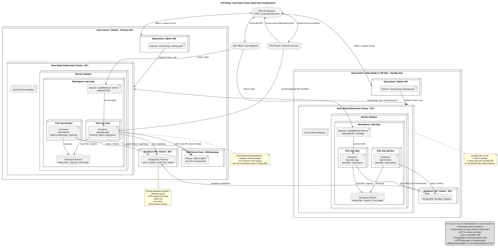

# OTP Relay Kubernetes Learning & Deployment Plan

## Purpose

This document outlines a practical plan to use the OTP Relay application as:

1. a **Kubernetes learning project on bare metal**, and
2. a path toward a **more robust dual-data-center deployment**.

The goal is to keep the first step simple enough for learning, while preparing the application for a more resilient production architecture later.

---

## Recommendation Summary

Use the OTP Relay as a **sample Kubernetes project**, but in **phases**:

- **Phase 1:** Containerize and deploy as a **single active instance** on bare-metal Kubernetes.
- **Phase 2:** Externalize persistent and workflow state into **PostgreSQL**.
- **Phase 3:** Extend to a **dual-data-center active/standby design**.
- **Phase 4:** Add controlled failover, monitoring, backups, and operational procedures.

This approach allows the team to learn Kubernetes fundamentals first, without introducing unnecessary complexity from distributed state and cross-site failover too early.

---

## Why This Is a Good Learning Project

The OTP Relay is a good learning workload because it is:

- small and understandable end-to-end,
- operationally relevant,
- internally useful,
- simple enough to containerize quickly,
- complex enough to teach real infrastructure concepts.

It can help the team learn:

- containerization,
- Kubernetes Deployments and Services,
- ConfigMaps and Secrets,
- persistent storage,
- health probes,
- logging and monitoring,
- bare-metal service exposure with MetalLB,
- backup and disaster recovery thinking.

---

## Important Architectural Principle

At the moment, the OTP Relay should be treated as a **stateful application**.

Even if the codebase is small, the service has persistent operational concerns such as:

- logs,
- user/configuration data,
- OTP claim or assignment workflow state,
- audit trails,
- device/phone monitoring events.

For this reason:

- **do not start with active/active across both data centers**
- **do not rely on local in-memory-only workflow state**
- **do not treat dual-site deployment as only a container scheduling problem**

The key to robustness is moving important state into a durable backend such as **PostgreSQL**.

---

## Target Technology Stack

### Initial learning stack
- **K3s** on bare metal
- **MetalLB** for LoadBalancer IPs on bare metal
- **Docker or Podman** for building images
- **Helm** optionally for packaging
- **Persistent Volumes** for temporary local persistence
- **ConfigMaps / Secrets** for runtime configuration

### More robust later-stage stack
- **K3s in both data centers**
- **PostgreSQL primary/standby replication**
- **App containers in both sites**
- **Operational failover process**
- **Monitoring and alerting**
- **Backups and restore tests**

---

## Phased Plan

## Phase 1 – Use It as a Kubernetes Learning Workload

### Objective
Run the OTP Relay in Kubernetes in a simple, controlled, single-active-instance design.

### Scope
- Create container image(s)
- Deploy into a dedicated namespace
- Use ConfigMaps and Secrets
- Add health probes
- Expose service on the LAN
- Use persistent volume only where needed
- Document deployment and operations

### Recommended deployment model
- **One active instance only**
- One site active
- No cross-site failover yet
- Minimal operational risk

### Kubernetes concepts to learn
- Namespace
- Deployment
- Service
- Secret
- ConfigMap
- PVC
- Readiness probe
- Liveness probe
- Logs
- Rolling update

---

## Phase 2 – Externalize State

### Objective
Prepare the application for resilience and future HA.

### Changes recommended
Move critical state out of:
- local files,
- local-only process memory,
- host-specific assumptions.

Move critical state into **PostgreSQL**:
- workflow or claim queue,
- audit trail,
- user/configuration records where appropriate,
- delivery attempts / event history,
- operational status records.

### Benefits
- safer restart behavior,
- easier failover,
- fewer split-brain risks,
- better auditability,
- more natural multi-instance design later.

---

## Phase 3 – Dual Data Center Active/Standby

### Objective
Deploy the service architecture across two locations.

### Recommended topology
- **DC1:** primary / active
- **DC2:** standby / DR
- PostgreSQL primary in DC1
- PostgreSQL replica in DC2
- Application deployed in both sites
- Only one site actively serving business traffic at a time, unless and until the application is redesigned for safe multi-instance behavior

### Why active/standby first
This is much simpler and safer than active/active for a stateful OTP workflow.

---

## Phase 4 – Operations, Failover, Monitoring

### Objective
Make the service operationally robust.

### Add:
- backup and restore procedures,
- DB replication monitoring,
- pod and node monitoring,
- alerting,
- failover runbook,
- recovery test procedure,
- security hardening,
- image update process.

---

## Deployment Diagram



---

## Practical First Implementation Recommendation

For the first real implementation, keep it simpler than the full target diagram:

### First deploy like this
- one Kubernetes cluster or one active namespace in **DC1**
- one OTP Relay application instance
- one monitor instance
- one PostgreSQL instance
- one persistent volume
- MetalLB for service exposure
- documented manual recovery steps

### Only later extend to
- PostgreSQL replication to DC2
- standby app deployment in DC2
- failover process
- recovery testing

---

## Suggested Repository Structure

```text
docs/
  otp-relay-k8s-plan.md
  diagrams/
    otp-relay-deployment.puml

deploy/
  base/
    namespace.yaml
    deployment.yaml
    service.yaml
    configmap.yaml
    secret-example.yaml
    pvc.yaml
  overlays/
    dc1/
    dc2/

helm/
  otp-relay/
```

---

## Suggested Next Steps

1. Containerize the application cleanly.
2. Separate configuration from code.
3. Define persistent data explicitly.
4. Create Kubernetes manifests for a single active deployment.
5. Test restart behavior.
6. Introduce PostgreSQL.
7. Migrate critical state into the database.
8. Add standby design in the second data center.
9. Create failover and recovery runbooks.
10. Test disaster recovery.

---

## Final Position

This project is a **very good Kubernetes learning project** if approached in phases.

It is **not** best used initially as a full multi-site HA design exercise.  
The best learning value comes from:

- starting small,
- learning the Kubernetes fundamentals well,
- then refactoring the application to support robust failover.

That path gives both:
- practical learning for the team, and
- a realistic route toward a more robust production service.
